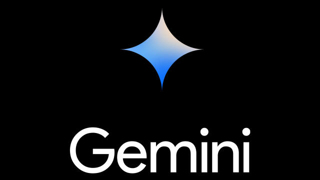

## Generative AI - Gemini

**Welcome to the Google Cloud Generative AI - Gemini**

Gemini is a family of generative AI models developed by Google DeepMind that is designed for multimodal use cases. The Gemini API gives you access to the Gemini Pro Vision and Gemini Pro models.

### Vertex AI Gemini API
On Google Cloud, the Vertex AI Gemini API provides a unified interface for interacting with Gemini models. There are currently two models available in the Gemini API:

* `Gemini Pro model (gemini-pro)`: Designed to handle natural language tasks, multiturn text and code chat, and code generation.
* `Gemini Pro Vision model (gemini-pro-vision)`: Supports multimodal prompts. You can include text, images, and video in your prompt requests and get text or code responses.

The notebooks and samples in this folder focus on using the Vertex AI SDK for Python to call the Vertex AI Gemini API.